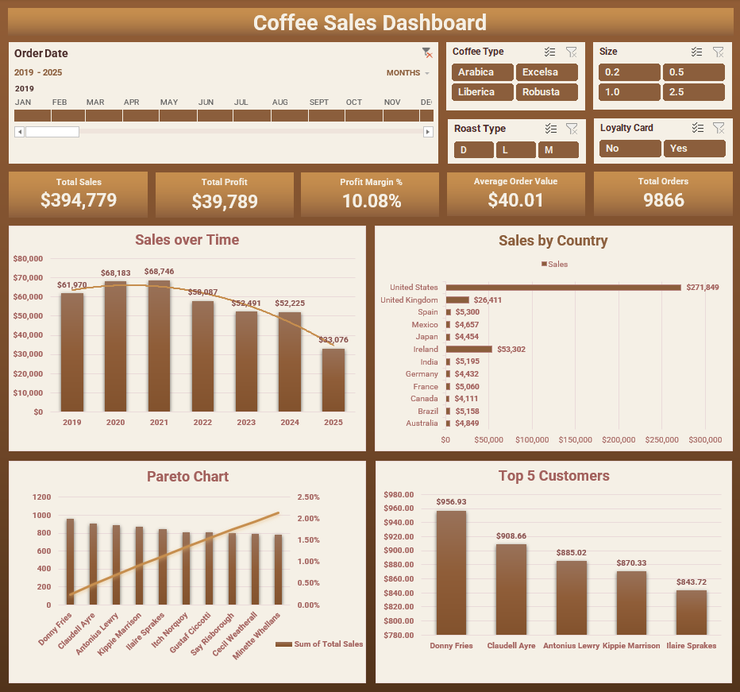
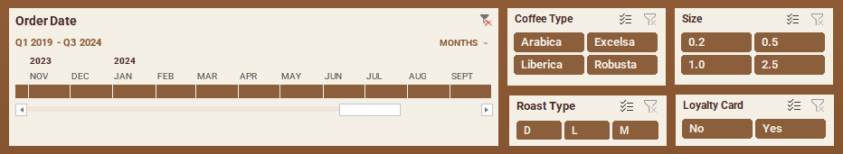
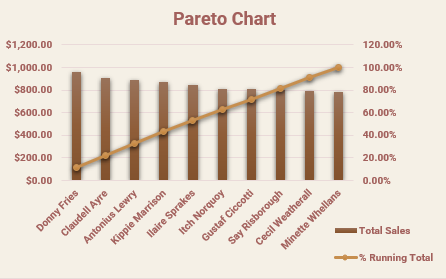
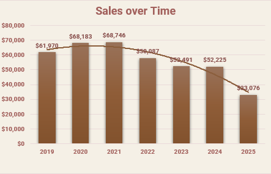
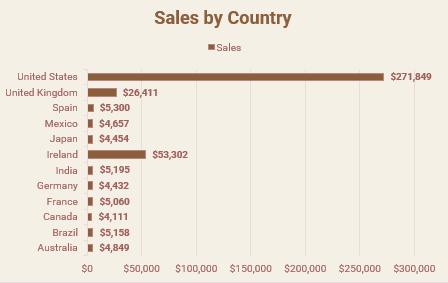
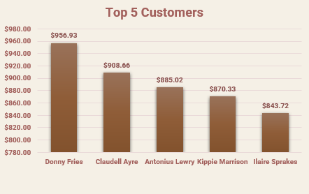

# Excel-Powered Business Intelligence: A Deep Dive into Coffee Sales

## 📈 Project Overview

This project showcases a complete business intelligence workflow, from raw, messy data to a fully interactive and insightful dashboard. The goal was to analyze a coffee sales dataset to uncover actionable insights that could drive revenue, enhance profitability, and inform marketing strategy.

The analysis moves beyond simple reporting, demonstrating a robust ETL pipeline, advanced data modeling, and complex analytic, all within Microsoft Excel. The final result is an executive-ready dashboard designed for dynamic exploration and data-driven decision-making.

**▶️ Live Demo:** **[Link to a 2-Minute Video Walkthrough on Loom or YouTube]** *(Will be added shortly)*

## ❓ Key Business Questions Answered

The dashboard was built to answer critical business questions at a glance:

1.  **Sales Performance:** What are our key revenue and profit trends over time, and can we identify seasonality?
2.  **Product Profitability:** Which products are our bestsellers, and more importantly, which ones are the most *profitable*? Where are our hidden gems with high profit margins?
3.  **Geographic Hotspots:** Which countries are driving the most sales, and where are the emerging markets?
4.  **Customer Value & Loyalty:** What is the real lifetime value (CLV) of our customers? Are members of our loyalty program genuinely more valuable than non-members?
5.  **The 80/20 Rule:** Which vital few customers are generating the majority of our revenue?

## 🖼️ Dashboard Visualizations

**Main Dashboard View**

**Timeline and Slicers**

**KPIs**

**Sales over Time**

**Sales by Country**

**Pareto Analysis: The 80/20 Rule in Action**

**Top 5 Customers**

## 🛠️ The BI Workflow & Technical Stack

This project was built using a modern Excel BI toolkit, demonstrating skills across the entire analytics pipeline.

### 1. ETL & Data Cleaning (Power Query)

The initial data, expanded to 10,000+ orders, was intentionally corrupted with realistic errors to simulate a real-world scenario. 
A robust ETL (Extract, Transform, Load) pipeline was built in **Power Query** to handle these issues automatically:

*   **Data Integration:** Merged three separate tables (`Orders`, `Customers`, `Products`) into a clean, unified dataset
*   **Duplicate Removal:** Identified and removed fully duplicated order entries.
*   **Data Validation:** Filtered out invalid records, such as orders with a quantity of zero or negative numbers.
*   **Text Cleansing & Standardization:** Used `Trim`, `Capitalize Each Word`, and `Replace Values` to standardize inconsistent `Country` names (e.g., "  usa ", "USA", "united states" all became "United States").
*   **Handling Missing Data:** Identified and removed records with critical missing information (e.g., null values in the `Country` field).
*   **Orphaned Record Removal:** Performed an `Inner Join` to ensure every order record corresponds to a valid customer, removing any orphaned data.

### 2. Data Modeling & Advanced Analytics (Power Pivot & DAX)

The cleaned data was loaded into Excel's **Power Pivot** engine to create a relational Data Model (a star schema). This enabled sophisticated calculations using **DAX (Data Analysis Expressions)**:

*   **Calculated Columns** to enrich the data tables:
    *   `Customer Lifetime Value (CLV)`: Calculates the total revenue generated by each customer.
    *   `Purchase Frequency`: Counts the number of unique orders placed by each customer.
*   **DAX Measures** for dynamic, aggregated analysis:
    *   `Profit Margin %`: A crucial KPI to measure the profitability of any data slice.
    *   `Unique Order Count`: A distinct count of orders, providing an accurate metric for AOV calculations.

### 3. Data Visualization & Reporting (Excel Dashboard)

The final insights are presented in a fully interactive dashboard featuring:

*   **KPI Cards:** Clear, at-a-glance metrics for Total Sales, Total Profit, Profit Margin %, and Average Order Value.
*   **Advanced Charting:**
    *   **Map Chart:** For intuitive visualization of sales distribution by country.
    *   **Pareto Chart:** To instantly identify the top 20% of customers who generate 80% of the revenue.
    *   **Dynamic Combo & Bar Charts:** To explore trends and comparisons.
*   **Interactive Controls:** Slicers and Timelines allow for seamless filtering of the entire dashboard by Roast Type, Size, Loyalty Status, and Date.

### 4. Synthetic Data Generation (Python)

To create a more challenging and realistic dataset, the original 1,000 orders were expanded to over 10,000 using a **Python** script with the **Pandas** and **Faker** libraries. This process also introduced the specific data quality issues mentioned above, providing a foundation to demonstrate advanced data cleaning skills.

## 🔑 Key Insights & Findings

*(Will be added shortly)*

*   **Insight 1: [Your Insight Title - e.g., Profit vs. Popularity Paradox]**
    *   *Finding:* [*(Will be added shortly)*]
    *   *Business Implication:* [*(Will be added shortly)*]

*   **Insight 2: [Your Insight Title - e.g., The 80/20 Rule in Action]**
    *   *Finding:* [*(Will be added shortly)*"]
    *   *Business Implication:* [*(Will be added shortly)*"]

*   **Insight 3: [Your Insight Title - e.g., Quantified Value of the Loyalty Program]**
    *   *Finding:* [*(Will be added shortly)*]
    *   *Business Implication:* [*(Will be added shortly)*"]

---

### 🚀 Future Enhancements & Learning Roadmap

*   **Time Intelligence Analysis:** Implement more advanced DAX time intelligence functions like `SAMEPERIODLASTYEAR`, `YTD`, and `MTD` to compare performance against historical periods.
*   **Market Basket Analysis:** Analyze which products are most frequently purchased together to inform cross-selling strategies and product bundling.
*   **Predictive Analytics:** Utilize Excel's forecasting tools or Python's `statsmodels` library to build a simple sales forecast based on historical data.
*   **Migration to Power BI:** For enhanced scalability, collaboration, and cloud-based features, the next logical step would be to migrate this entire data model and report into **Microsoft Power BI**.
