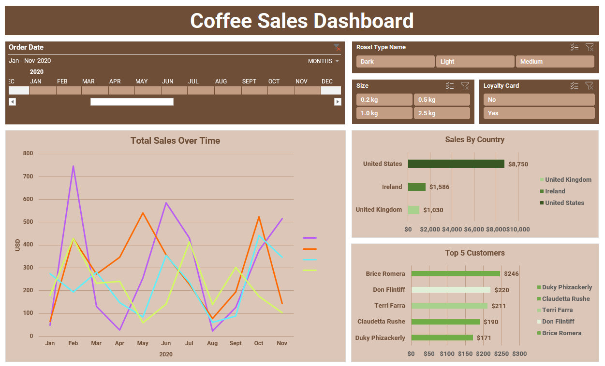
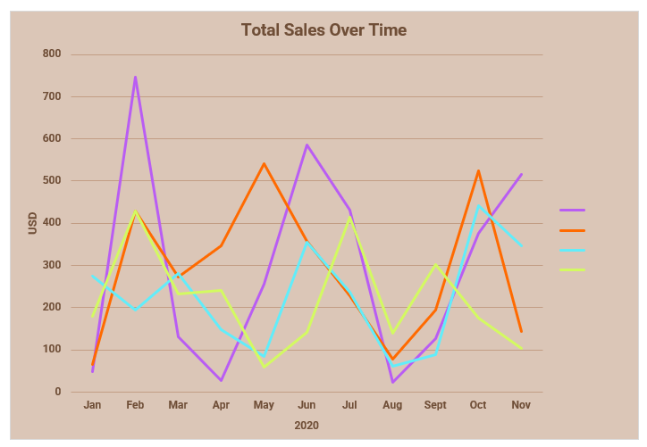
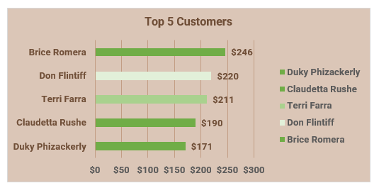
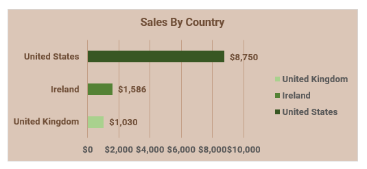

# Excel Sales Data Analysis & Visualization: Coffee Sales

## Project Overview

This project provides a comprehensive sales analysis for a coffee business, delivering actionable insights to drive revenue growth and optimize marketing spend. By creating an interactive dashboard, stakeholders can now instantly identify top-performing products, pinpoint key geographic markets, and understand the purchasing behavior of their most valuable customers.

## 📊 Dashboard Features

The Excel dashboard includes the following interactive elements:

*   **Sales Trend Analysis:** The interactive timeline allows for tracking revenue performance over time to identify seasonal trends and measure the impact of sales initiatives.
*   **Product Performance Analysis:** By filtering by **Roast Type** and **Size**, we can determine which products are the most popular and which have untapped potential. For example, the dashboard reveals that Medium Roast is the highest-selling roast type overall.
*   **Geographic Sales Insights:** The **Sales by Country** chart pinpoints our most lucrative markets, enabling targeted marketing campaigns and resource allocation.
*   **Customer Segmentation:** The **Loyalty Card** slicer helps us understand the value of our loyalty program by comparing the spending habits of members vs. non-members. This answers the critical question: "Do our loyalty members spend more?"
*   **High-Value Customer Identification:** The **Top 5 Customers** chart identifies our VIPs, providing a clear focus for customer retention and relationship management efforts.

## 🛠️ Tools & Techniques Used

*   **Microsoft Excel:**
    *   Data Cleaning & Preparation
    *   Pivot Tables & Pivot Charts
    *   Slicers
    *   Timeline
    *   Formulas (XLOOKUP, INDEX, MATCH)
    *   Dashboard Design

## 🖼️ Visualizations (Screenshots)

**Main Dashboard View:**

**Total Sales Over Time Chart:**

**Top 5 Customers Chart:**

**Sales by Country Chart:**

## 💾 Data Source

The data used includes 3 sample datasets of:
* 1000 Orders, including Order ID, Order date, Customer ID, Product ID, and Quantity.
* 1000 Customers, including Customer Name, Email, Phone Number, Address Line, City, Country, Postcode, Loyalty Card info
* 48 Products, including Product ID, Coffee Type, Roast Type, Size, Unit Price, Price per 100g, Profit

## 🚀 How to Use / Explore

1.  **Download the Excel file:** [Coffee Sales Analysis Dashboard Workbook](excel_file/Coffee_Sales_Analysis_Dashboard.xlsx)
2.  Open the file in Microsoft Excel.
3.  Interact with the timeline and slicers on the 'Dashboard' sheet to filter the data and observe changes in the charts.

## 💡 Key Learnings & Challenges

*   Combining data from different tables into a single one (Orders F:P). 
*   Learned to effectively combine a timeline and multiple slicers for granular data filtering.
*   Ensuring dashboard responsiveness with large pivot table datasets.
